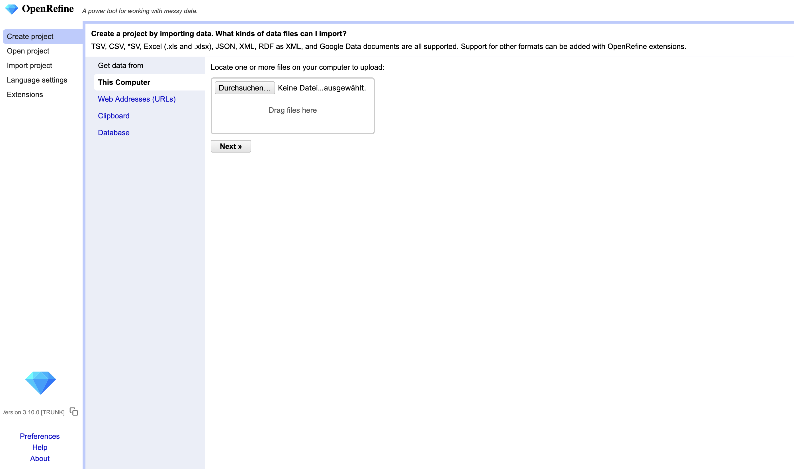
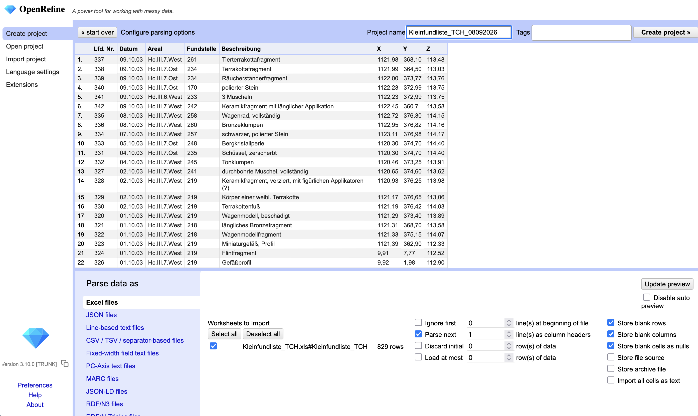
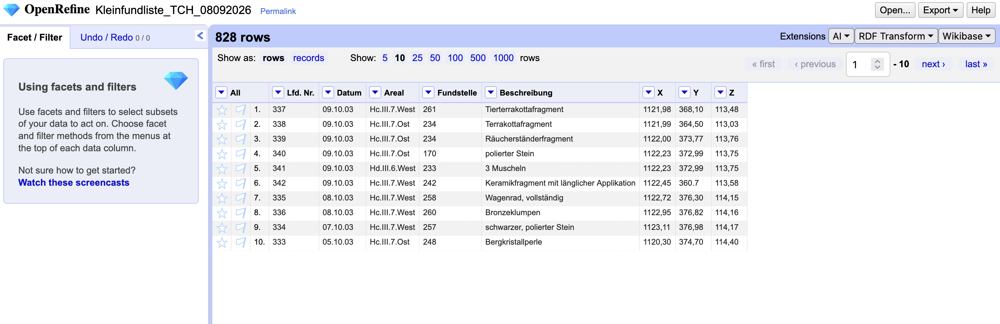

## Einleitung

Szenario: Ich erhalte im Forschungsprojekt eine Tabelle mit hunderten oder gar tausenden Einträgen. Leider ist die Dokumentation, wie die Datensätze entstanden sind, nicht mehr auffindbar. Dennoch ist meine Aufgabe, aus den Daten statistische Analysen zu erstellen. Ein erster Blick in die Tabelle zeigt, dass dort einiges drin steht, allerdings anscheinend keine standardisierten Eingaben gemacht wurden. Diese Tabelle muss zunächst einmal bereinigt werden, bevor sie für Analysen herangezogen werden kann.


### Lernziele {.kolophon .unnumbered .unlisted}

<!-- Idealerweise beziehen sie sich in dieser Aufzählung auf die Lernzielmatrix zum Themenbereich Forschungsdatenmanagement (FDM) für die Zielgruppen Studierende, PhDs und Data Stewards.^[Petersen, B., Engelhardt, C., Hörner, T., Jacob, J., Kvetnaya, T., Mühlichen, A., Schranzhofer, H., Schulz, S., Slowig, B., Trautwein-Bruns, U., Voigt, A., & Wiljes, C. (2023). Lernzielmatrix zum Themenbereich Forschungsdatenmanagement (FDM) für die Zielgruppen Studierende, PhDs und Data Stewards. Zenodo. [https://doi.org/10.5281/zenodo.8010617](https://doi.org/10.5281/zenodo.8010617)] -->

In diesem Skript lernen sie [@petersen2023]:

-   Kompetenz #.#

### Vorwissen {.kolophon .unnumbered .unlisted}

Für das Verständnis dieses Skripts werden vorausgesetzt:

-   Kenntnisse im Umgang mit tabellarischen Daten
-   Installation von OpenRefine (Eine Anleitung findet sich hier: [Installing OpenRefine](https://openrefine.org/docs/manual/installing))

<!-- Versuchen sie so detailliert wie möglich die Voraussetzungen für das Verständnis des Bausteins aufzuzählen. Geben sie Hinweise, wo die Lernenden entsprechende/s Kompetenzen/Wissen erwerben können. Damit sind nicht nur Kenntnisse im Forschunsdatenmanagement gemeint sondern auch Grund-Kompetenzen aus der Data Literacy und methodisch-praktische Kompetenzen gemeint. -->

### Bezug zum Forschungsdatenlebenszyklus {.kolophon .unnumbered .unlisted}

```{=html}
<!-- Erläutern sie kurz, welche Rolle das Thema im Bezug auf die Phasen im Forschungsdatenzyklus spielen.

-   planen und projektieren
-   sammeln und erfassen
-   anreichern und auswerten
-   archivieren und sichern

-->
```

```{=html}
<!-- 

Hier ist der Raum für die Inhalte des Skripts. Nutzen sie die vielfältigen Möglichkeiten, Inhalte mit Quarto-Markdown zu gestalten. Ersetzen Sie die Überschriften "Inhaltliche Abschnitte" und "Abschnitt-Überschrift".

Viele Hinweise dazu finden sie im [Quarto-Guide](https://quarto.org/docs/guide/)

-->
```
## Wieso OpenRefine? 

OpenRefine ist ein leistungsfähiges Werkzeug für die Bereinigung und Transformation tabellarischer Daten und bietet für die Arbeit mit archäologischen Forschungsdaten mehrere zentrale Vorteile: Die Software läuft vollständig lokal auf dem eigenen Rechner, sodass sensible oder noch nicht publizierte Forschungsdaten das eigene System nicht verlassen müssen. Sie ist zudem open source und damit frei verfügbar sowie ohne Lizenzkosten einsetzbar. Ein besonderes Merkmal ist die automatische Dokumentation des gesamten Arbeitsprozesses – jede einzelne Veränderung an den Daten wird protokolliert und kann jederzeit nachvollzogen sowie rückgängig gemacht werden. Dabei bleiben die ursprünglichen Rohdaten unverändert erhalten. OpenRefine unterstützt eine Vielzahl an Dateiformaten für den Import und Export und lässt sich mit wenig bis keinen Programmierkenntnissen bedienen. Mithilfe von Funktionen wie der Facettierung erhält man schnell einen Überblick über die in den Daten enthaltenen Werte. Durch Datentransformationen sowie Clustering lassen sich diese effizient bereinigen und vereinheitlichen.

## Archäologischer Datensatz

### Tell Chuera - Kurzzusammenfassung der Grabungsgeschichte

Tell Chuera ist ein Siedlungshügel in Nordsyrien (Jezireh-Region), der bereits zum Ende des Chalcolithikums besiedelt wurde (3100 v. Chr., 14C-datiert). Der Siedlungshügel umfasst rund 65 ha und ist durch eine innere und äußere Stadtbefestigung gekennzeichnet. In der Mitte des 3. Jahrtausends vor Christus war Tell Chuera ein Wirtschaftszentrum, das gemeinsam mit den umliegenden Orten und anderen Zentren der Region ein übergreifendes Wirtschaftssystem bildete. Anders als die anderen wissesnschaftlich erforschten wirtschaftlichen Zentren in der Jezireh wurde in Tell Chuera nie die Keilschrift adaptiert. Informationen über die wirtschaftlichen Strukturen und Prozesse in Tell Chuera ergeben sich daher - wie bei vielen unserer Kolleg:innen mit weiteren schriftlosen Forschungsschwerpunkten - lediglich aus dem archäologischen Befund.

Der Fundort Tell Chuera wurde im 20. und im frühen 21. Jahrtausend extensiv unter Anwendung verschiedenener archäologischer Methoden untersucht, darunter Luftbildaufnahmen (Flugzeug, Drache), geomagnetische Prospektionen, archäozoologische Analysen, Sedimentanalysen bis hin zur klassischen Ausgrabung.

Der hier vorliegende Datensatz stammt aus der Feder von Henrike Backhaus, die in ihrem Disserationsprojekt den "Grabungsbereich H" bearbeiten sollte.\[\^die Dissertation liegt aktuell wegen beruflicher anderweitiger Verpflichtungen und wirtschaftlicher Notwendigkeiten auf Eis\]

Beim Grabungsbereich H handelt es sich um ein Grabungsareal im Südosten der Oberstadt (innere Stadtbefestigung). Ausgegraben wurden in diesem Bereich Gassen, Wege und Hausgrundrisse.

In insgesamt 13 Grabungskampagnen unter drei verschiedenen Direktoren wurden seit den späten 1950er bis in die frühen 2000er Jahre archäologische Daten aus Bereich H erfasst. Dabei legten die Ausgräber je einen unterschiedlichen Fokus auf dokumentierte Fundgattungen - die Technologie und Dokumentationsstandards veränderten sich (von groben Lokalisierungen der Funde bis hin zu Tachymeter-Einmessungen) - und die Nomenklatur der beschriebenen Funde und Befunde war ebenfalls nicht durchgehend standardisiert.

### Rohdaten aus Bereich H ("Häuserviertel")

Im Folgenden arbeiten wir mit einem fingierten (!) Datensatz, der sowohl die unterschiedlichen Dokumentationsweisen der drei Direktionen beinhaltet, als auch einen Teil bereits durch Henrike Backhaus bereinigter Daten.

--\> Szenario: Legacy Data / Altgrabungsdaten - Excel Tabelle (ggf. noch csv) mit nicht standardisierten Eintragungen - nicht für Statistik geeignet. Abgebrochenes Projekt, alle Daten in einer Tabelle vorliegend. --\> DISCLAIMER SICHTBAR EINBAUEN, nicht dass noch jemand ernsthafte Statistiken mit den Daten machen will

::: column-screen-inset
| Lfd. Nr. | Datum | Areal | Fundstelle | Beschreibung | X | Y | Z |
|---------|---------|---------|---------|---------|---------|---------|---------|
| 337 | 09.10.2003 | Hc.III.7.West | 261 | Tierterrakottafragment | 1121,98 | 368,10 | 113,48 |
| 308 | 30.09.2003 | Hc.III.7.Ost | 219 | Kopf einer weibl. Terrakotte | 9,99 | 6,60 | 112,51 |
| 323 | 01.10.2003 | Hc.III.7.West | 219 | Miniaturgefäß, Profil | 1121,39 | 362,90 | 112,33 |
:::

Die folgende Tabelle zeigt einen Auszug aus dem fingierten Rohdatensatz des Grabungsbereichs H. Sie enthält die folgenden acht Spalten:

- **Lfd. Nr.** – laufende Nummerierung der Funde.
- **Datum** – Datum der Grabung.
- **Areal** – Grabungsareal, kodiert in hierarchischer Form (z. B. `Hc.III.7.West`).
- **Fundstelle** – Nummer der Fundstelle innerhalb des Areals.
- **Beschreibung** – Beschreibung des Fundes (Materialität und Form, z. B. „Tierterrakottafragment", „Kopf einer weibl. Terrakotte", „Miniaturgefäß, Profil").
- **X, Y, Z** – Koordinaten der Funde im Grabungsareal.

Bereits auf den ersten Blick wird deutlich, dass die Daten uneinheitlich dokumentiert sind: Die Koordinaten weisen zum Teil stark abweichende Werte auf (vgl. die Werte `1121,98` vs. `9,99` in Spalte **X**), und in der Spalte **Beschreibung** sind unterschiedliche Informationstypen vermischt. Diese Beobachtungen bilden den Ausgangspunkt für die folgenden Bereinigungsschritte in OpenRefine.


### Zieldaten

Ziel der Datenbereinigung ist eine statistische Analyse der Funde sowie eine räumliche Darstellung in einem geographischen Informationssystem (GIS). Hierfür müssen die Daten zunächst gesichtet, bereinigt und standardisiert werden. Wichtig sind dafür unter anderem eine **eindeutige Identifizierungsnummer** für jeden einzelnen Fund, die Aufteilung von Sammelfunden sowie die Identifikation von Funden mit fehlenden oder fehlerhaften Koordinaten. Weiterhin versuchen wir die Spalte **Beschreibung**, in der Materialität und Beschreibung der Funde zusammen vorliegen, zu trennen und zu standardisieren.

## Erste Schritte in OpenRefine


### Import der Daten

Um mit der Datenbereinigung zu beginnen, wird zunächst OpenRefine geöffnet. Beim Start öffnet sich automatisch ein Browserfenster (unter der Adresse http://127.0.0.1:3333/), das die Startseite anzeigt. OpenRefine strukturiert die Arbeit in Projekte. Um zu beginnen, muss zunächst ein neues Projekt angelegt und der Datensatz (Excel-Datei) importiert werden.

::: {.panel-tabset}

#### Arbeitsschritte

1.  Auf `Create Project` klicken und anschließend auf `Get data from This Computer`.

2.  Auf `Browse` klicken, die Excel-Datei des Datensatzes auf dem Computer suchen und sie auswählen.

3.  Auf `Next` klicken und die Daten in OpenRefine hochladen. Auf der nächsten Seite zeigt OpenRefine eine Vorschau der Daten, mit deren Hilfe geprüft werden kann, ob alles korrekt dargestellt wird, bevor fortgefahren wird.

4.  Wenn die Vorschau und die Einstellungen passen, kann oberhalb der Vorschau der Projektname geändert und auf `Create Project` geklickt werden. OpenRefine lädt die Daten auf der nächsten Seite in den Arbeitsbereich.

#### Screenshots

{fig-alt=""}

{fig-alt=""}

:::

::: {.callout-note title="Importeinstellungen"}
In OpenRefine kann eine Vielzahl von Dateiformaten importiert werden: CSV, TSV, Excel-Dateien, JSON und XML.
:::

### Grundelemente der Benutzeroberfläche

Die OpenRefine-Oberfläche ist um einen zentralen Arbeitsbereich organisiert. Das Hauptfenster zeigt die Daten in einem tabellarischen Format, dem sogenannten Grid, mit Zeilen und Spalten ähnlich wie in einer Tabellenkalkulation: Eine Zeile stellt einen Datensatz dar, und jede Spalte repräsentiert eine bestimmte Art von Information. Oberhalb der Tabelle im Grid-Header kann ausgewählt werden, wie viele Zeilen gleichzeitig angezeigt werden sollen, und durch die Spalten der Tabelle navigiert werden.

Jeder Spaltenkopf verfügt über einen kleinen Pfeil. Durch Klick auf diesen Pfeil öffnet sich ein Drop-down-Menü mit Aktionen, die sich nur auf diese Spalte beziehen – etwa das Sortieren, die Facettierung und die Bearbeitung der Werte. Diese Aktionen werden in den folgenden Kapiteln vorgestellt.

Auf der linken Seite zeigt der Reiter `Facet/Filter` alle aktiven Filter und Facetten. Diese Werkzeuge ermöglichen es, den Datensatz zu erkunden und zu beobachten, wie sich die Aktionen auf ihn auswirken. Der Reiter `Undo/Redo` protokolliert jede einzelne Änderung, die an den Daten vorgenommen wird. Von hier aus kann schrittweise vor- und zurückgegangen werden durch die Änderungen.

{fig-alt="Benutzeroberfläche von OpenRefine"}

## Duplikate entfernen

Zu Beginn der Datenbereinigung sollte zunächst geprüft werden, ob der Datensatz Duplikate enthält.

::: {.panel-tabset}

#### Arbeitsschritte

`All` → `Edit rows` → `Remove duplicate rows`
Dort kann eingestellt werden, welche Spalten in die Prüfung auf Duplikate miteinbezogen werden. Zu Beginn werden alle Spalten einbezogen. X werden rausgelöscht.

#### Screenshots

Inhalt Tab B

:::

## Facettierung

Zunächst wird ein Überblick über die vorliegenden Daten verschafft. Dies gelingt in OpenRefine über die Funktionalität der **Facettierung**. Mithilfe der Facettierung können alle verschiedenen Werte, die in einer Spalte vorkommen, gruppiert und gesehen werden, wie oft sie auftreten. Eine Facette erstellt eine Art interaktive Zusammenfassung der Daten: Sie listet alle eindeutigen Werte einer Spalte auf und zeigt an, wie oft jeder einzelne davon vorkommt. Dadurch erhält man sehr einfach einen schnellen Überblick über die Daten in einer Spalte.

Um eine Facettierung vorzunehmen, wird auf den blauen Pfeil im Spaltenkopf geklickt, `Facet` gewählt und – je nach Spaltentyp – `Text Facet`, `Numeric Facet` oder `Timeline facet` als Facettentyp ausgewählt. Auf der linken Seite erscheint nun ein Reiter mit allen Werten der jeweiligen Spalte sowie einer Zahl, die die Häufigkeit des jeweiligen Wertes in der Spalte angibt.

::: {.callout-note title="Text Facet"}
Beim Import des Datensatzes werden die Spalten standardmäßig als Strings, also Zeichenketten, eingelesen. Aus diesem Grund werden die Spalten – auch wenn es sich um Zahlen handelt – von OpenRefine als Strings interpretiert.

Um eine andere Art der Facettierung (z. B. eine Numeric Facet) durchzuführen, müssen die Werte zunächst in einen numerischen Datentyp umgewandelt werden.
:::

### Grabungsareal

Die Spalte **Areal** enthält verschachtelte Informationen, die durch Punkte voneinander getrennt sind (z. B. `Hc.III.7.West`). Um diese Information für eine spätere Auswertung nutzbar zu machen, empfiehlt es sich, die Spalte aufzuteilen.

::: {.panel-tabset}

#### Arbeitsschritte

1.   Im Spaltenkopf **Areal** auf den Pfeil klicken und `Edit column` → `Split into several columns` wählen.

2.   Als Separator den Punkt `.` angeben.

3.   OpenRefine erzeugt mehrere neue Spalten, die die einzelnen Bestandteile des Areal-Codes enthalten (z. B. `Hc`, `III`, `7`, `West`).

Anschließend können die neu entstandenen Spalten mit einer **Text Facet** facettiert werden, um die Werte zu sichten, Tippfehler zu identifizieren und bei Bedarf zu vereinheitlichen.

#### Screenshots

Inhalt Tab B

:::

### Fehlende und fehlerhafte Koordinaten identifizieren

Um eine räumliche Darstellung der Funde in einem GIS vorzunehmen, muss jeder Fund über Koordinaten verfügen. Um zu prüfen, ob für jeden Fund Koordinaten vorhanden sind, wird die Facettierung auf die Spalten mit den Koordinaten angewendet. Hierfür wird im Spaltenkopf `Facet` → `Customized Facets` → `Facet by blank` ausgewählt. Nun erscheinen links die Werte `false` und `true`. Wenn auf `true` geklickt wird, erhält man alle Funde, die über keine X-Koordinate verfügen und somit für eine räumliche Darstellung in einem GIS unbrauchbar sind – übrig bleiben nur noch 584 von ursprünglich 828 Funden für die räumliche Darstellung.

Auch in den Spalten **X**, **Y** und **Z** lassen sich mithilfe der Facettierung Ausreißer und fehlerhafte Werte identifizieren. Auffällige Werte können anschließend manuell korrigiert oder – falls das nicht möglich ist – gelöscht werden, sodass sie die räumliche Darstellung nicht verzerren.

::: {.panel-tabset}

#### Arbeitsschritte

Inhalt Tab A

#### Screenshots

Inhalt Tab B

:::

## Transformation

### Erstellen einer eindeutigen Identifizierungsnummer

Bei den Tabellenspalten **Lfd. Nr.** und **Fundstelle** könnte es sich um eindeutige Identifizierungsnummern handeln. Dafür wird eine Facettierung für jede der beiden Spalten durchgeführt und festgestellt, dass beide Spalten Werte aufweisen, die häufiger als einmal vorkommen. Beispiel: Die **Lfd. Nr.** `001` liegt dreifach vor, da sie in den Kampagnenjahren 2002, 2003 und 1987 vergeben wurde. Damit eignen sich beide Spalten nicht als eindeutige Identifizierungsnummern. Es muss also eine neue Spalte aus mehreren vorhandenen Spalten kreiert werden, um zu einer eindeutigen Identifizierungsnummer zu gelangen.

#### Kampagnenjahr aus dem Datum extrahieren

Zunächst wird die Spalte **Datum** facettiert und festgestellt, dass manchmal ein konkreter Tag angegeben ist, manchmal nur eine Jahreszahl. Das Kampagnenjahr soll vom Datum getrennt werden, um zu sehen, wie viele Kampagnen der Datensatz umfasst.

::: {.panel-tabset}

#### Arbeitsschritte

1.   Im Spaltenkopf **Datum** auf den Pfeil klicken und `Edit column` → `Add column based on this column` wählen.

2.   Als Spaltenüberschrift `Kampagnenjahr` eintragen.

3.   Folgende GREL-Expression eingeben:

`if(value.contains("."), value.split(".")[2], value)`

Diese Funktion prüft, ob die Zelle einen Punkt `.` enthält. Ist das der Fall, wird der Inhalt der Zelle am Separator `.` in einzelne Fragmente aufgespalten und das dritte Fragment als Inhalt der neuen Zelle verwendet. Andernfalls wird der ursprüngliche Wert übernommen.

Auf die so entstandene Spalte kann wieder eine Facettierung angewendet werden, und es werden die Werte `02` und `03` sichtbar. Durch Klick auf `Edit` neben diesen Werten können alle Vorkommen gleichzeitig auf das korrekte Kampagnenjahr `2002` bzw. `2003` geändert werden.

#### Screenshots

Inhalt Tab B

:::

Nun wird auf einen Blick sichtbar, dass der Datensatz 10 unterschiedliche Kampagnenjahre umfasst.

#### ID aus mehreren Spalten konstruieren

::: {.panel-tabset}

#### Arbeitsschritte

1. Über `Edit column` → `Join Columns` können mehrere Spalten zu einer einzigen Spalte zusammengeführt werden.

2.   Im neuen Fenster einen Separator angeben (z. B. `-`).

3.   `Write result in new column named` anhaken und den Namen der neuen Spalte eintragen (z. B. `ID`).

4.   Die Spalten auswählen, die in die ID aufgenommen werden sollen, und durch Drag-and-Drop in die gewünschte Reihenfolge bringen.

5.   Abschließend das Fundortkürzel `TCH` über `Edit cells` → `Transform` mit folgender GREL-Expression ergänzen: `"TCH-" + value`

Jeder Fund soll eine ID aus Fundort (TCH) – Kampagnenjahr – Fundstelle – Lfd. Nr. erhalten.

#### Screenshots

Inhalt Tab B

:::

#### Sammelfunde aufteilen

In manchen Fundstellen wurden mehrere Funde geborgen. Diese sogenannten Sammelfunde müssen für eine statistische Analyse in Einzelfunde aufgeteilt werden.

::: {.panel-tabset}

#### Arbeitsschritte

1.   Die Zeilen filtern, in denen die Beschreibung mehrere Fundnummern enthält (mithilfe eines regulären Ausdrucks wie `\d+`).

2.   Über `Edit column` → `Add column based on this column` eine neue Spalte erzeugen und die enthaltenen Zahlen extrahieren – z. B. mit folgender GREL-Expression: `value.replace(/[^0-9]/, "")`

3.  Die neue Spalte facettieren und die Inhalte bei Bedarf manuell nacharbeiten.

4.   Über `Add column based on this column` eine weitere Spalte `Anzahl Einzelfunde in Sammelfund` mit folgender GREL-Expression erzeugen: `forRange(0, value.toNumber(), 1, i, i+1).join("|")`

5.  Über `Edit cells` → `Split multivalued cells` wird die Spalte in einzelne Werte aufgeteilt, sodass jeder Einzelfund eine eigene Zeile erhält.

6.  Um die Werte einheitlich als dreistellige Zahlen darzustellen, `Edit cells` → `Transform` wählen und folgende GREL-Expression eintragen: `"00" + value`

#### Screenshots

screenshot einfügen von Trennung der Sammelfunde

:::

#### ID um Sammelfunde erweitern

Jeder Fund soll eine ID aus Fundort (TCH) – Kampagnenjahr – Fundstelle – Lfd. Nr. – (Sammelfunde um 00X erweitert) erhalten.

Hierfür wird die Spalte **Zahl** facettiert und die Zahlen von 1–9 ausgewählt und durch `00` erweitert.

Bei Zahlen größer als 10 wird nur eine führende `0` ergänzt.

Wie oben beschrieben wird die Spalte **ID** um die Sammelfundnummern erweitert: `Edit cells` → `Transform` unter Einbeziehung der Spalte **Sammelfunde**.

### Clustering

In der Spalte **Beschreibung** liegen Informationen zur Fundkategorie, zur Materialität und zur Anzahl der Funde gemeinsam in einer Zelle vor. Diese müssen für eine anschließende Analyse getrennt werden.

::: {.panel-tabset}

#### Arbeitsschritte

Zunächst werden die in der Beschreibung enthaltenen Zahlen identifiziert und vom beschreibenden Text separiert. Die Spalte **Beschreibung** wird mit `Edit column` → `Add column based on this column` dupliziert und die neue Spalte **Materialität** benannt.

Nun kann mithilfe des Clustering versucht werden, die Inhalte der Spalten anzugleichen. Hierfür `Edit cells` → `Cluster and edit` auswählen. Im erscheinenden Fenster können unterschiedliche Clustering-Methoden und -Verfahren angewendet werden. Wenn auf `Clustering` geklickt wird, werden Gruppen aufgrund von Ähnlichkeiten gebildet.

#### Screenshots

screenshot einfügen von clustering

:::

## Export

### Export der Zieldaten und des gesamten Projekts

Der bereinigte Datensatz kann in verschiedenen Formaten wie `tsv`, `csv` oder `html` exportiert werden – je nachdem, wie die Daten im weiteren Arbeitsprozess genutzt werden sollen. Diese Optionen finden sich unter `Export` auf der rechten Seite der Projektleiste.

Hier besteht außerdem die Möglichkeit, das gesamte OpenRefine-Projekt (Daten und Bearbeitungshistorie) zu exportieren, um es mit Kolleg:innen zu teilen oder als Projektbackup zu sichern. In diesem Fall wird `OpenRefine project to archive file` gewählt, woraufhin eine Archivdatei (`.tar.gz`) auf den Computer heruntergeladen wird.

::: {.panel-tabset}

#### Arbeitsschritte

Arbeitsschritte als nummerierte Liste einfügen

#### Screenshots

screenshot einfügen

:::

### Export der Bearbeitungshistorie

Im Reiter `Undo/Redo` wird der gesamte Bearbeitungsprozess als eine Abfolge von Anweisungen gespeichert. OpenRefine kann diese Anweisungen als JSON-Datei exportieren. Diese Datei enthält nicht die bereinigten Daten selbst, sondern ausschließlich die einzelnen Bearbeitungsschritte, die auf die Daten angewendet wurden. Gemeinsam mit den Rohdaten bilden sie die Grundlage für ein transparentes Forschungsdatenmanagement.

::: {.panel-tabset}

#### Arbeitsschritte

1. Zum Reiter `Undo/Redo` wechseln.
2. Auf `Extract...` klicken.
3. Es öffnet sich ein Dialogfenster, das auf der rechten Seite alle Bearbeitungsschritte im JSON-Format anzeigt. Über die Kontrollkästchen auf der linken Seite kann ausgewählt werden, welche Schritte in die JSON-Datei aufgenommen werden sollen.
4. Anschließend kann auf `Export` geklickt oder der JSON-Code manuell kopiert und in einer Datei gespeichert werden.

#### Screenshots

screenshot einfügen

:::

## Weiterführende Quellen und Informationen {.appendix .unnumbered}

<!-- Der Ort für weiterführende Quellen und Informationen. Wenn Sie Fußnoten oder Literaturverweise im Text eingefügt haben, werden die bibliographischen Angaben automatisch in weiteren Abschnitten generiert und in das Dokument eingefügt. -->

## Nachnutzen {.appendix .unnumbered}

Alle sind herzlich eingeladen, **diesen Baustein** und die zugehörige Copyleft-Lizenz zu nutzen, um ihr Wissen und Expertise in die Verbesserung und Aktualisierung einzubringen. Alle können die Inhalte erweitern oder überarbeiten, zum Beispiel um Anwendungsszenarien und Nutzungskontexte zu erweitern.

Unser Wunsch ist ein lebendiges, stetig wachsendes Dokument, das sich durch die Beiträge vieler verändert - im Einklang mit eines sich wandelnden Umfelds. Wir freuen uns im Falle einer Überarbeitung über eine kurze Notiz – das ist aber selbstverständlich keine Pflicht.

<!-- Verweise auf Website und Repository werden in _oer_metadata.yml global festgelegt. Wenn die OER nicht in einem git-Repository gehostet oder online bereitgestellt werden, können die folgenden zwei Zeilen gelöscht werden. -->

:link: [Dieser Baustein als Website]()

:link: [Quarto-Quellcode dieses Bausteins]()

------------------------------------------------------------------------

Dieses Skript nutzt das [OER-Skript-Template von NFDI4Objects](https://github.com/nfdi4objects/oer-template-skript)

## Disclaimer: Einsatz von LLM {.appendix .unnumbered}

<!-- Optionale Angaben zum Einsatz von LLM bei der Erstellung oder Überarbeitung des Skripts -->

```{=html}
<!-- An dieser Stelle werden von Quarto automatisch generierte Abschnitte angehängt:

Bibliographie:
Erstellt aus den in der qmd-Datei mit [@bibtex-Schlüssel] referenzierten Einträgen aus der Datei bibliographie.bib.
Im Text nicht referenzierte Einträge aus der bibliographie.bib werden nicht zitiert.
Der Zitierstil wird in der _oer_metadata.yml mit dem Schlüssel 'csl:' festgelegt. Im Verzeichnis /assets/csl/ sind gängige Zitierstile als csl-Datei vorhanden. Weitere sind hier zu finden: https://www.zotero.org/styles

Lizenz:
Angabe wird übernommen aus Schlüssel 'license:' in _oer_metadata.yml

Urheber:innen
Angabe wird übernommen aus der _oer_metadata.yml Schlüssel 'copyright:'

Zitiervorschläge
Mit BibTeX zitieren:
Automatisch von Quarto aus den Metadaten insb. aus dem Schlüssel 'citation:' in der _oer_metadata.yml generiertes bibtex-Zitat.

Bitte zitieren Sie diesen OER-Baustein als:
Angabe generiert aus:
  _autor_innen.yml
  Schlüssel 'title:' in der qmd-Datei
  Schlüssel 'issued' in der _oer_metadata.yml
  Schlüssel 'doi:' in der _oer_metadata.yml / Wenn keine doi gesetzt wird der Titel mit dem Wert aus 'site-url:' in _oer_metadata.yml verlinkt.
-->
```